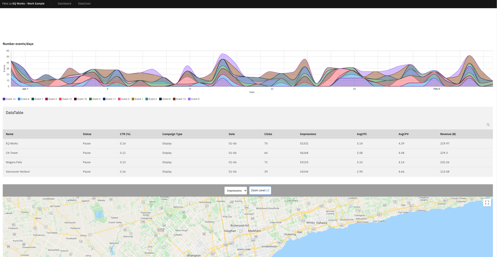

# A work sample from EQWork for internship position - version 1

There are two folders in the repository.

1. Backend (with some requirements)
2. Front-end (built by ReactJS, redux-toolkit, carbon-charts, styles-components .etc.)



## How it work

**cd to folder respectively**

1. Backend

   1.1 URL API

```json
https://mellow-flaxen-germanium.glitch.me/

```

1.2 install and add dotenv library

```javascript
// Fix error BE install and paste this code into index.js
require('dotenv').config();
```

1.3 run

```nodejs
yarn
yarn run dev
```

2. [Turn on CORS](https://www.moesif.com/blog/technical/cors/Authoritative-Guide-to-CORS-Cross-Origin-Resource-Sharing-for-REST-APIs/)

3. Run FE

```nodejs
yarn
yarn start
```
